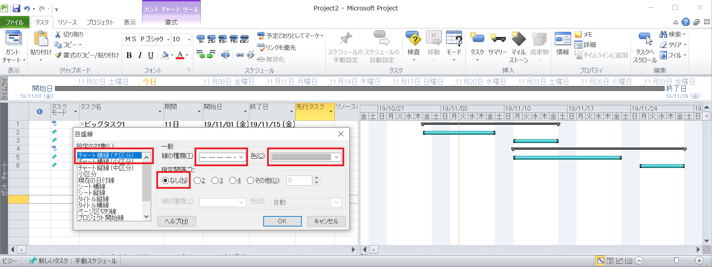

# Tip of Ms Project

## Display scale lines

1. First, open context menu, select 目盛線
  
2. To display vertical lines
  
  
3. To display hirozontal lines
  
  

## Adjust the calendar scale to print large period

1. Select contect menu, select タイムスケール
  
2. Select calendar setting
  
  
