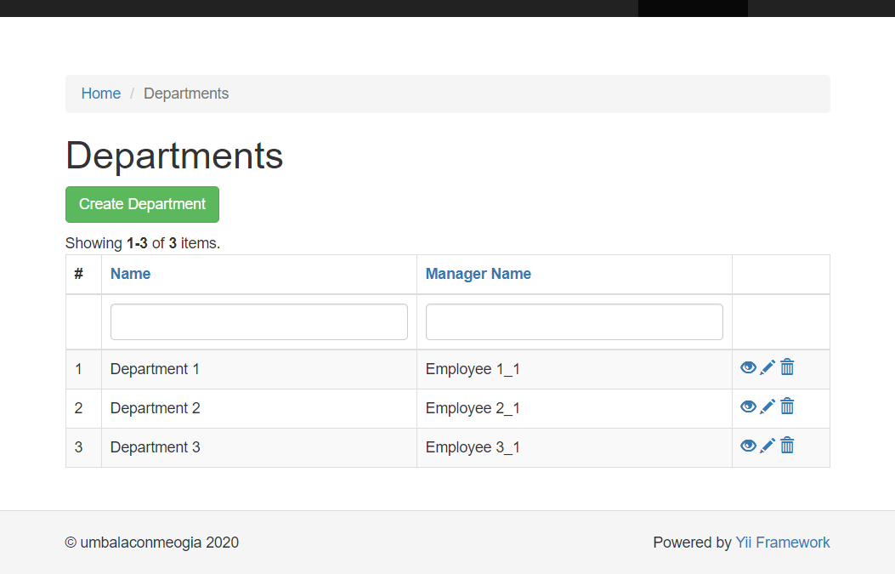
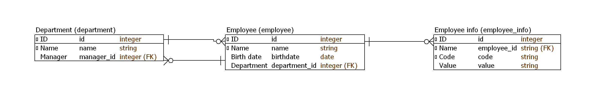
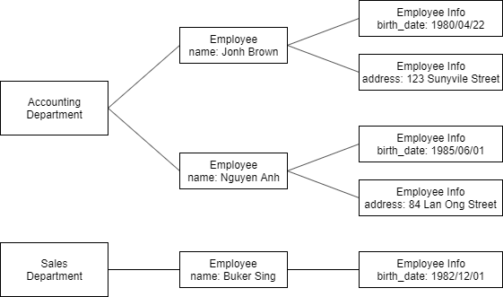

# yii2 GridView tips

## Search and sort for external join table attributes

In GridView that showing data of Department, we want to allow searching and sorting with department manager's name.



### Add safe attribute $managerName to DepartmentSearch class.

```php
class DepartmentSearch extends Department
{
    public $managerName;

    public function rules()
    {
        return [
            [['managerName'], 'safe'],
            // Other stuff
        ];
    }
}
```

### Translation of additional attribute label

It's optional, but we may want provide i18n for `$managerName` attribute.

We can add it into `Department#attributeLabels()`,
but it is not good because Department does not know about attribute `managerName`.

The prefer way is to add it into `DepartmentSearch#attributeLabels()`.
We should also change the model class of the query from `Department` to `DepartmentSearch` (because GridView's DataColumn will find the label in the model of the query).

`DepartmentSearch#attributeLabels()` must return values set in `Department#attributeLabels()`, too.

```php
class DepartmentSearch extends Department
{
    public function attributeLabels()
    {
        return array_merge(parent::attributeLabels(), [
            'managerName' => Yii::t('app', 'Manager name'),
        ]);
    }

    public function search($params)
    {
        // Replace Department by DepartmentSearch
        $query = DepartmentSearch::find()->joinWith('manager mang');

        // other stuff
    }
}
```

### Add searching condition by `$managerName`.

```php
class DepartmentSearch extends Department
{
    public function search($params)
    {
        // Join with manager relation.
        $query = DepartmentSearch::find()->joinWith('manager mang');
        // Other stuff

        // Add searching condition by managerName
        $query->andFilterWhere(['like', 'mang.name', $this->managerName]);
        // Other stuff
    }

}
```

### Add sorting for `$managerName`

```php
class DepartmentSearch extends Department
{
    public function search($params)
    {
        // Other stuff
        $dataProvider->sort->attributes['managerName'] = [
            // The tables are the ones our relation are configured to
            // in my case they are prefixed with "tbl_"
            'asc' => ['mang.name' => SORT_ASC],
            'desc' => ['mang.name' => SORT_DESC],
        ];
        // Other stuff
    }
}
```

## Search for clustering external join table attributes

We have EmployeeInfo model, that is used to store every `attribute` of Employee such as gender, birth_date, address, each in one record.
Here we don't store these attributes as columns in Employee model horizontally, but store them in EmployeeInfo vertically.
One example of this data is the way Yii store i18n translate message in `message` table, that is linked to `message_source` table.

Now we want to use these attributes info in Employee horizontally.

The point is we create a variable `Employee#employeeInfoValues` which is an array, to store EmployeeInfo value.
We can access to every EmployeeInfo value via `Employee#employeeInfoValues`, use `Employee#employeeInfoValues` to
* Generate form fields and receive input from form.
* Create filter on GridView and searching in search model.

* Decale `Employee#employeeInfoValues`, set it as safe so that it can received data from form.
  ```php
    class Employee extends \yii\db\ActiveRecord
    {
        /**
        * @var string[] Store EmployeeInfo(s) value (map between info code and its value)
        */
        public $employeeInfoValues;

        public function rules()
        {
            return [
                [['employeeInfoValues'], 'safe'],
                // other stuff
            ];
        }
    }
  ```
* Initate `Employee#employeeInfoValues` in constructor
  ```php
    public function __construct($config = [])
    {
        // Initiate $this->employeeInfoValues
        foreach (EmployeeInfo::codes() as $code) {
            $config['employeeInfoValues'][$code] = null;
        }
        parent::__construct($config);
    }
  ```
* Set `Employee#employeeInfoValues` in afterFind() and store it in afterSave()
  ```php
    public function afterFind()
    {
        foreach ($this->employeeInfoValues as $code => $one) {
            $this->employeeInfoValues[$code] = $this->getEmnployeeInfoValue($code);
        }
        parent::afterFind();
    }

    public function afterSave($insert, $changedAttributes)
    {
        if ($insert) {
            // Create new EmployeeInfo(s)
            foreach ($this->employeeInfoValues as $code => $value) {
                $model = new EmployeeInfo();
                $model->employee_id = $this->id;
                $model->code = $code;
                $model->value = empty($value) ? NULL : $value;
                $model->save();
            }
        } else {
            // Update EmployeeInfo(s) by input value stored in $this->employeeInfoValues.
            foreach ($this->employeeInfos as $employeeInfo){
                $code = $employeeInfo->code;
                $employeeInfo->value = empty($this->employeeInfoValues[$code]) ? NULL : $this->employeeInfoValues[$code];
                $employeeInfo->save();
            }
        }

        parent::afterSave($insert, $changedAttributes);
    }
  ```
* Use `Employee#employeeInfoValues` in search model
  ```php
    public function search($params)
    {
        // other stuff

        // Join with EmployeeInfo horizontally.
        $infoCodes = EmployeeInfo::codes();
        foreach ($infoCodes as $code) {
            $query->leftJoin("employee_info $code", "{$code}.employee_id = employee.id AND {$code}.code = :code", ['code' => $code]);
        }
        // other stuff

        // Add search condition of EmployeeInfo
        foreach ($infoCodes as $code) {
            if (isset($this->employeeInfoValues[$code])) {
                $query->andFilterWhere(['like', "{$code}.value", $this->employeeInfoValues[$code]]);
            }
        }
        // other stuff
    }
  ```
* Use `Employee#employeeInfoValues` in GridView
  ```php
    foreach (EmployeeInfo::codes() as $code){
        $columns[] = [
            'label' => Yii::t('app', $code),
            'value' => function(Employee $model) use ($code) {
                return $model->employeeInfoHashCode[$code]->valueStr;
            },
            'format' => 'ntext',
            'filter' => '<input type="text" class="form-control" name="EmployeeSearch[employeeInfoValues][' . $code . ']">',
            'contentOptions' => ['class' => 'text-nowrap'],
        ];
    }
  ```
* Use `Employee#employeeInfoValues` in form
  ```php
    <?= $form->field($model, 'employeeInfoValues[' . EmployeeInfo::CODE_BIRTH_DATE . ']')
        ->label(EmployeeInfo::codeLabel(EmployeeInfo::CODE_BIRTH_DATE))
        ->textInput(['type' => 'date']) ?>

    <?= $form->field($model, 'employeeInfoValues[' . EmployeeInfo::CODE_GENDER . ']')
        ->label(EmployeeInfo::codeLabel(EmployeeInfo::CODE_GENDER))
        ->radioList(EmployeeInfo::genderOptionArr()) ?>

    <?= $form->field($model, 'employeeInfoValues[' . EmployeeInfo::CODE_ADDRESS . ']')
        ->label(EmployeeInfo::codeLabel(EmployeeInfo::CODE_ADDRESS))
        ->textInput(['maxlength' => true]) ?>
  ```
## Example code

Example code is put in `example_app` directory.

### Prequisite

This example code is deveoped based on yii-basic-app-2.0.35 template.

### Installation

To install dependencies
```shell
composer install
```

### DB design

Database structure


Example of data

