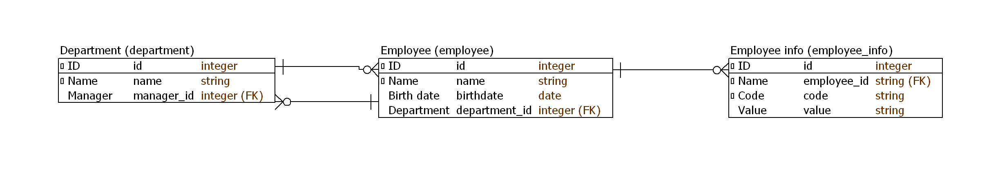
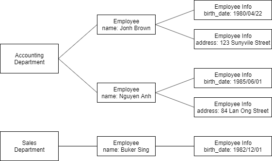

# yii2 GridView tips

## Search for external join table attributes

In GridView that showing data of Department, we want to allow searching with department manager's name.

* In DepartmentSearch, adding safe attribute $managerName, and add it to search condition.
  ```php
    class DepartmentSearch extends Department
    {
        public $managerName;

        public function rules()
        {
            return [
                [['managerName'], 'safe'],
                // Other attributes
            ];
        }

        public function search($params)
        {
            $query = Department::find()->joinWith('manager mang');
            // Other process

            $query->andFilterWhere(['like', 'mang.name', $this->managerName]);
            // Other process
        }

    }
  ```

## Search for clustering external join table attributes

## Sort for external attributes

## Example code

### Prequisite

This example code is deveoped based on yii-basic-app-2.0.35 template.

### Installation

To install dependencies
```shell
composer install
```

### DB design

Database structure


Example of data

