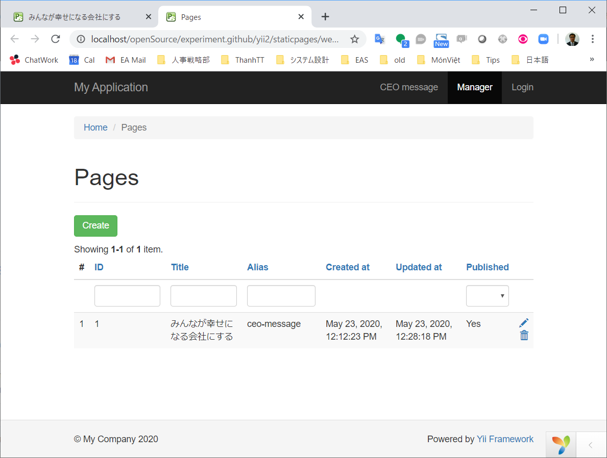
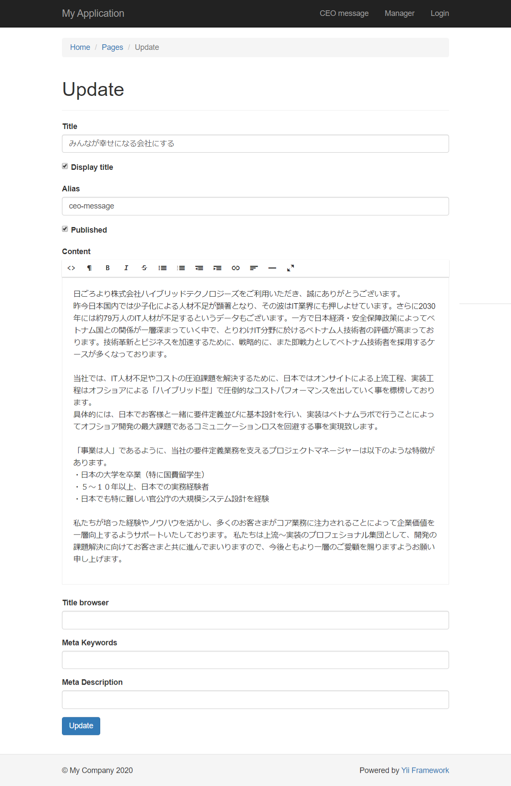
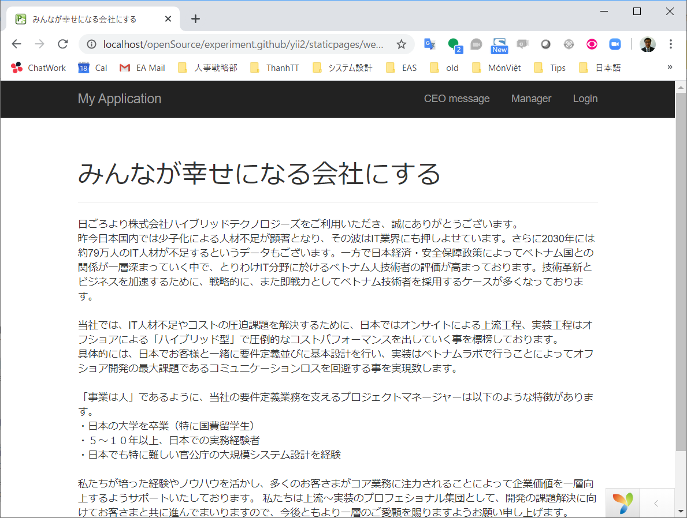

# Experiment of yii2-pages

This is example code of using [bupy7/yii2-pages](https://github.com/bupy7/yii2-pages).

## Screen shots

### Manager pages

* Page list
  
* Edit a page
  

## Display to user

